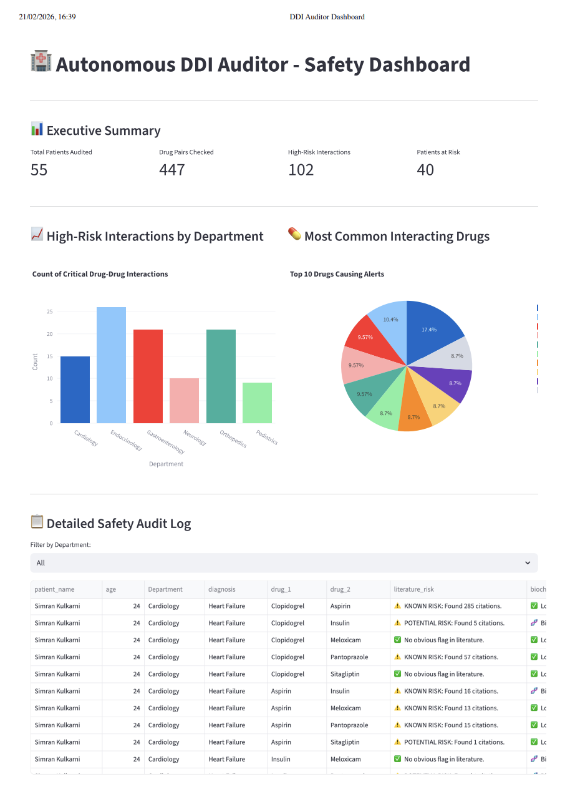

# 🏥 Autonomous Drug-Drug Interaction (DDI) Auditor




## 📖 Overview
The Autonomous DDI Auditor is an intelligent, multi-agent Python system designed to identify dangerous medication combinations (polypharmacy) in patient databases. It acts as a safety net, actively researching drug pairs using the **NCBI PubMed API** and analyzing their chemical structures using **RDKit**.

This project demonstrates advanced skills in **Data Engineering, API Integration, Complex SQL, Software Optimization, and Native UI Development**.

---

## ✨ Features
1. **Agentic Workflow**: Specialized agents (Database, Literature, Biochemist) hand off tasks to complete the audit.
2. **LLM-Simulated Summaries**: The Literature Agent synthesizes PubMed citation counts into readable clinical risk summaries.
3. **Cheminformatics**: Uses Tanimoto Similarity indexing to predict risks when literature is unavailable.
4. **Intelligent Caching Engine**: An optimized cache layer prevents redundant API calls and heavy biochemical computations, drastically reducing execution time.
5. **Dynamic Data Routing**: Automatically generates SQLite databases (`audit_results.db`, `high_risk_patients.db`) partitioned by medical department.
6. **Advanced SQL Sandbox**: Includes 10 complex queries (`outputs/advanced_queries.sql`) featuring CTEs, Window Functions, and advanced joins.
7. **Premium Native Dashboard**: A high-fidelity, scrollable Python desktop application built with `CustomTkinter` and `Matplotlib` for visual data exploration.

---

## 🚀 How to Run the Project Local

### 1. Prerequisites
You need Python installed. It is highly recommended to use a virtual environment with Tkinter support (built-in on most Mac/Windows systems).

```bash
# Create a virtual environment
python3 -m venv venv

# Activate it (Mac/Linux)
source venv/bin/activate
```

### 2. Install Dependencies
```bash
pip install -r requirements.txt
```

### 3. Generate the Patient Data
First, we need to generate our synthetic hospital database.
```bash
python3 scripts/database_setup.py
```
*(This creates `outputs/patients.db` with 100 patients across 6 departments).*

### 4. Run the AI Audit
Unleash the agents on the database. Grab a coffee, as it makes real-time API calls to the NIH/PubMed!
```bash
python3 scripts/main.py
```
*(This creates `outputs/audit_results.db`, splitting the findings into department tables).*

### 5. Extract High-Risk Patients
Route the most critical alerts into their own priority database.
```bash
python3 scripts/export_high_risk.py
```

### 6. Launch the Dashboard
Visualize the findings in your premium native desktop app:
```bash
# Double-click the macOS launcher OR run manually:
python3 scripts/gui_app.py
```

---

## 🗄️ Database Structure & SQL
The system generates several distinct SQLite databases:
*   `outputs/patients.db`: The raw, synthetic hospital data.
*   `outputs/audit_results.db`: The complete output of the AI agents. Contains individual tables for `Cardiology`, `Neurology`, etc.
*   `outputs/high_risk_patients.db`: Filtered alerts containing "Known Risks" and "High Structural Similarity".

Check out `outputs/advanced_queries.sql` to see how to manipulate these databases using CTEs and advanced aggregations!

---

## 🛡️ Graceful Error Handling
A truly autonomous system must fail gracefully. The DDI Auditor is built with robust error handling for real-world messy data:
- **API Down / Rate Limiting**: The `Literature Agent` utilizes retry mechanisms and exponential backoff. If the PubMed API fails entirely, it returns a safe "Unknown Literature Risk" flag rather than crashing the pipeline.
- **Invalid SMILES Strings**: Chemical datasets often contain malformed SMILES representations. The `Biochemist Agent` wraps RDKit molecular conversions in `try-except` blocks. If a molecule cannot be parsed, it logs the error and gracefully skips the structural comparison, ensuring the rest of the audit continues uninterrupted.
- **Database Resilience**: The system uses `sqlite3` best practices. It checks for table existence before querying, handles empty returns safely, and prevents UI crashes if the generator hasn't been run yet.

---

## 🧪 Architecture Flow
1. **Main Orchestrator** -> Asks **Database Agent** for Complex Patients.
2. **Database Agent** -> Queries SQLite, returns patients with 3+ meds.
3. **Main Orchestrator** -> Creates drug pairs, sends to **Literature Agent**.
4. **Literature Agent** -> Queries NCBI API. Returns clinical summaries.
5. **Main Orchestrator** -> If literature is safe/unknown, sends to **Bio-Chemist Agent**.
6. **Bio-Chemist Agent** -> RDKit structural analysis.
7. **Main Orchestrator** -> Writes final row to department-specific SQL table.

---
*Created as a Portfolio Project showcasing end-to-end data analytics and Python software engineering.*
